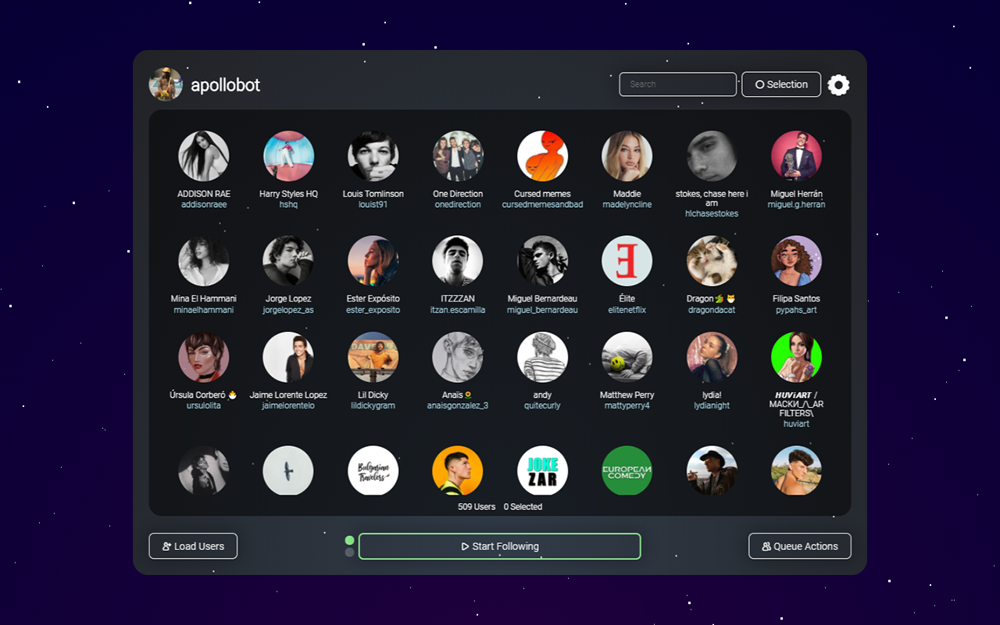
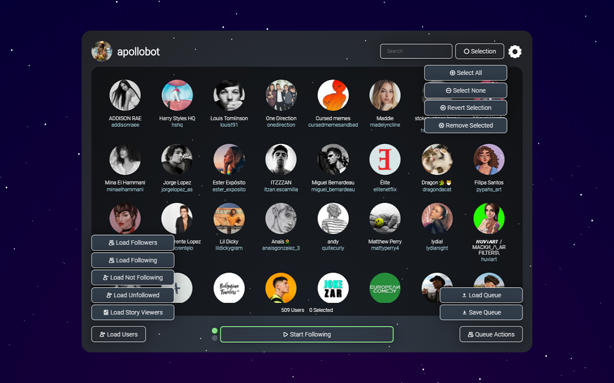
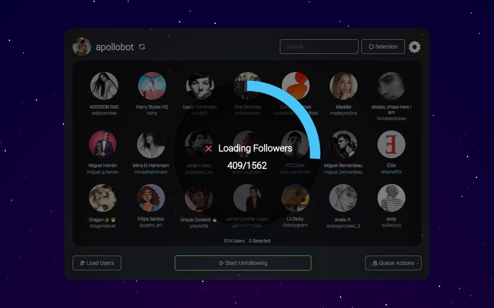
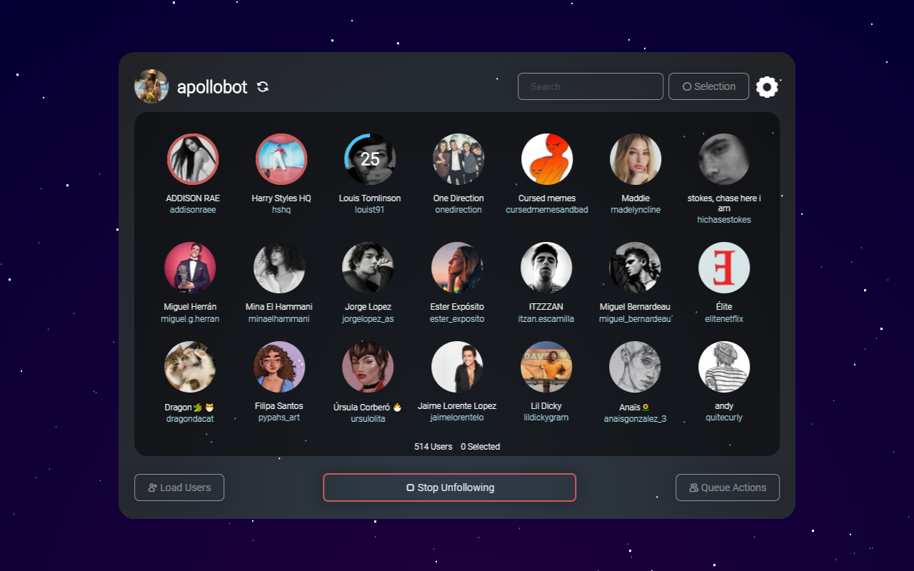
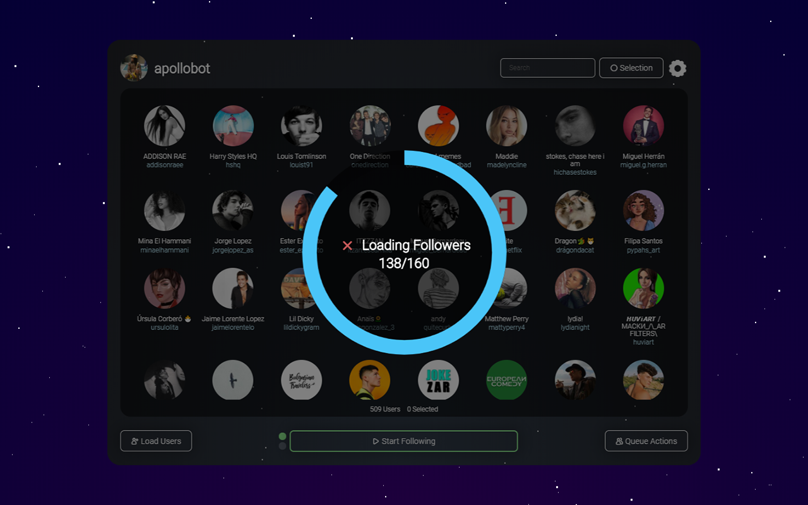

# ApolloBot

# Features
The main features of ApolloBot are the following:

1. Loading the followers and following of the current page. The range of users loaded can be specified.
2. Load the people not following back.
3. Load the people who have unfollowed since the last check.
4. Global users queue search by username and full name.
5. Showing who has viewed any of your last active stories. Combined with the search functionality you can easily know if a specific person has watched your story.
6. Load the people who have liked a specific post.
7. Removing specific people from the queue who you for example don't want to unfollow even if they don't follow you back.
8. Saving and loading queues in order to be processed later.
9. Basic and advanced settings allowing you to configure the timeouts, timeout randomization and even the queue hashes and application id in case Instagram™ change their APIs.

There are 2 modes for processing the users queue toggled by clicking the dots on the left side of the main button:

1. Start Following - by selecting this mode a pop-up will appear with options to select if you want to like any of the latest photos automatically, skip already followed/unfollowed users and skip private accounts.
2. Start Unfollowing - every user in the queue will be unfollowed.

# How to use
To use the extension just open Instagram™ and a new icon will appear in the top right corner. Go to your or another profile page and click the icon.

In case Instagram™ change their APIs there are written instructions on how to get the extension working again at http://apollo-bot.com/.

# Screenshots

