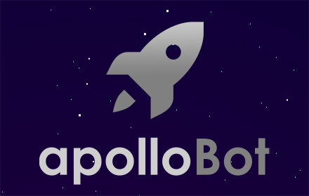
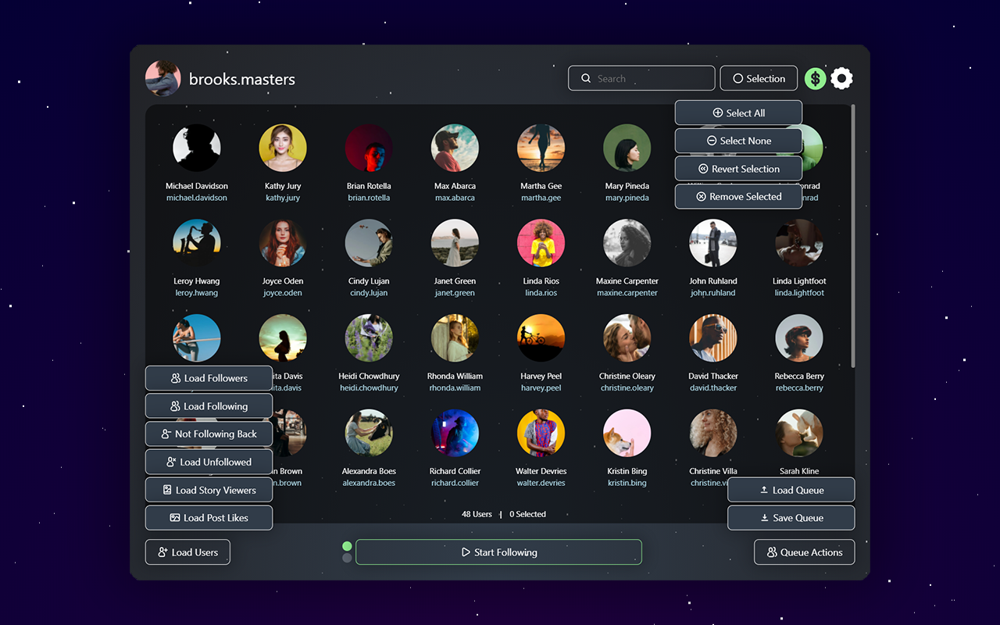
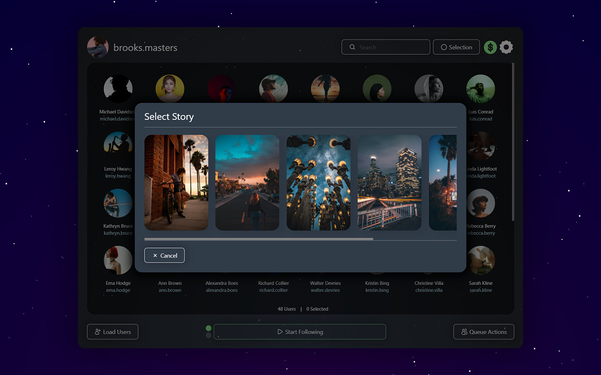
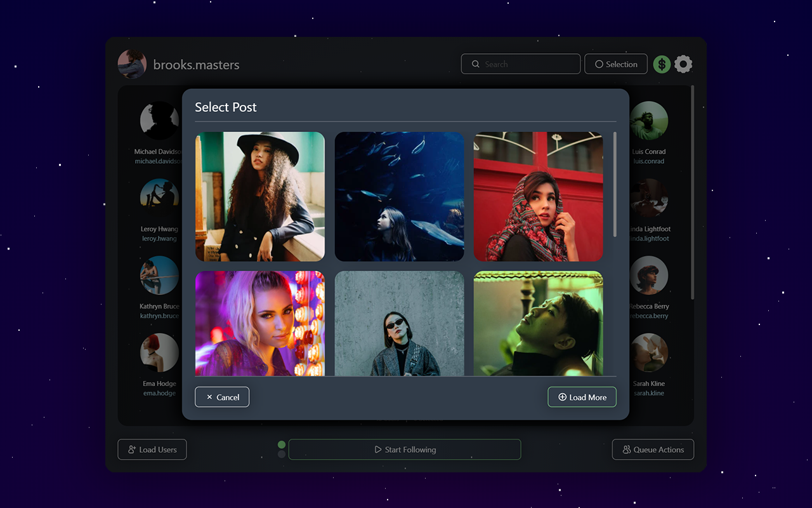
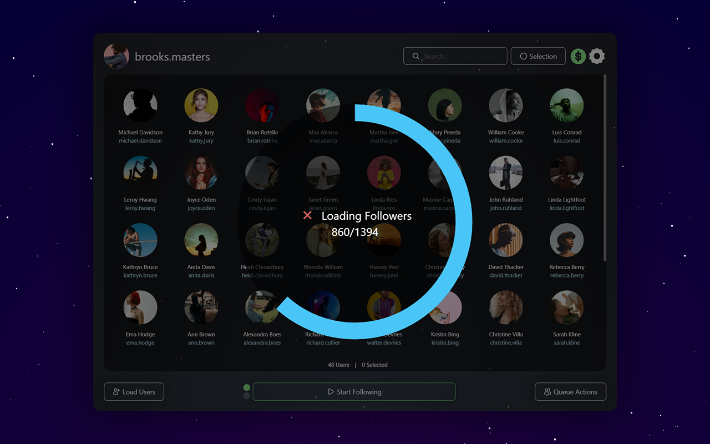
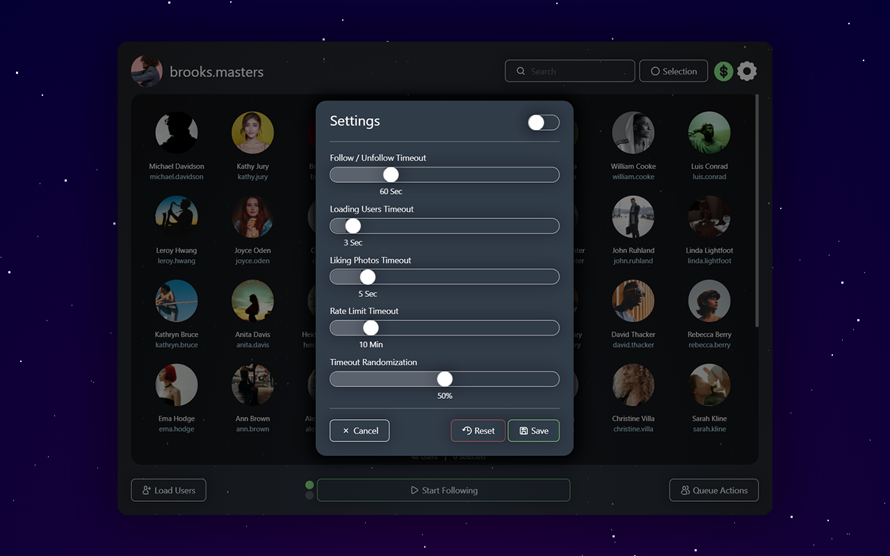

# ApolloBot

# Security
We don't collect any login information. The extension operates locally by making all requests on your behalf.

# Features
The main features of ApolloBot are the following:

1. Loading the followers and following of the current page. The range of users loaded can be specified.
2. Load the people not following back.
3. Load the people who have unfollowed since the last check.
4. Global users queue search by username and full name.
5. Showing who has viewed any of your last active stories. Combined with the search functionality you can easily know if a specific person has watched your story.
6. Load the people who have liked a specific post.
7. Removing specific people from the queue who you for example don't want to unfollow even if they don't follow you back.
8. Saving and loading queues in order to be processed later.
9. Basic and advanced settings allowing you to configure the timeouts, timeout randomization and even the queue hashes and application id in case Instagram™ change their APIs.
10. Automatic retry in case the Instagram™ rate limit is triggered.

There are 2 modes for processing the users queue toggled by clicking the dots on the left side of the main button:

1. Start Following - by selecting this mode a pop-up will appear with options to select if you want to like any of the latest photos automatically, skip already followed/unfollowed users and skip private accounts.
2. Start Unfollowing - every user in the queue will be unfollowed.

# How to use
To use the extension just open Instagram™ and a new icon will appear in the top right corner. Go to your or another profile page and click the icon. When the extension opens if you don't see a profile picture and a username in the top left corner please reload the page.

# Use cases
The extension can be used in many different ways. It can be used to either grow your account or get rid of people you don't want to follow anymore. For example if you want to grow your photography page you should go to another photography page and load its followers or post likers. Start following those people and configure liking at least 1 of their photos. You will quickly see how they start following you back and begin building engagement.

# Pricing
The extension has a 1 week trial including all of the functionality without any limits. The license key costs $3.99 per month and it can be used on up to 3 accounts, on unlimited number of devices. Payments are handled securely by PayPal™. Keep in mind we'll send you the license key to the email address registered to your PayPal™ account.

# Support
In case Instagram™ change their APIs there are written instructions on how to get the extension working again at https://apollo-bot.com/. If you have any questions or problems don't hesitate to contact us at support@apollo-bot.com.

# Notice
This extension is a standalone product not associated in any shape or form with Instagram™. All reserved trademarks are property to their respective owners.

# Screenshots

